# Migrate

Bring existing content into a new walnut. Triggered from `walnut:create` Step 5 only. Not user-invocable.

Two modes, auto-detected based on what's at the source path:

- **Seed mode** — a flat folder or small set of loose files. Capture-style processing.
- **Migration mode** — a structured project with brain files, references, working drafts, and live context. Full interpretation pipeline.

The conductor doesn't choose the mode. The squirrel scans the source and picks the right one.

---

## Entry Point

**You are reading this because the conductor answered "yes" to the existing content question in `walnut:create` Step 5.** The walnut has already been scaffolded (Step 4).

Ask the conductor what they want to bring in:

```
→ AskUserQuestion: "What do you want to bring across?"
- Files on my computer — I have a folder or project to migrate
- Context from this conversation — capture research/decisions from this session
- Both — files and conversation context
```

If "context from this conversation" — run Conversation Seed (see below).

If "files on my computer" or "both" — ask for the source path, then run Detection.

---

## Detection

**CRITICAL: Use a subagent for detection. Do NOT read source files in the main context.**

Dispatch a detection subagent with the source path. The subagent:

1. Runs `find` to count total files and measure total size
2. Checks for structural signals:
   - Brain-like directories: `_brain/`, `_core/`, `brain/`, `docs/`
   - Brain-like files: `status.*`, `tasks.*`, `changelog.*`, `insights.*`, `roadmap.*`, `log.*`, `now.*`, `key.*`
   - Reference directories: `_references/`, `references/`, `docs/`, with `raw/` subdirectories
   - Working directories: `_working/`, `working/`, `drafts/`
   - Multiple top-level subdirectories with their own READMEs
   - Nested project structure (3+ levels deep)
3. Returns a structured classification (NOT file contents):

```yaml
mode: migrate  # or "seed"
file_count: 1368
total_size: "60MB"
has_brain: true
brain_signals: ["_brain/status.md", "_brain/tasks.md", "_brain/changelog.md", "_brain/insights.md", "_brain/roadmap.md"]
has_references: true
has_working: true
top_level_folders: ["marketing", "engineering", "design", "operations", ...]
skip_candidates: [".credentials", ".DS_Store", ".specstory", ".claude"]
```

**Decision logic:**
- If `file_count < 20` AND `has_brain == false` AND no nested structure → **seed mode**
- Otherwise → **migration mode**

If the mode is ambiguous, present both options to the conductor and let them choose.

---

## Seed Mode

For small sets of loose files. Capture-style processing.

### Flow

1. List what was found:
   ```
   ╭─ 🐿️ found 6 files
   │
   │  - proposal-v2.pdf (document)
   │  - kai-call-notes.md (transcript)
   │  - competitor-screenshot.png (screenshot)
   │  - vendor-email-thread.eml (email)
   │  - research-notes.md (document)
   │  - IMG_4892.jpg (screenshot)
   │
   │  → capture all / select which / cancel
   ╰─
   ```

2. Dispatch subagents — one per file (or batch of 2-3 small files per subagent). Each subagent:
   - Classifies the file type (per `walnut:capture` Stage 0)
   - Copies raw to `_core/_references/{type}/raw/` with proper naming (`YYYY-MM-DD-descriptive-name.ext`)
   - Renames garbage filenames (CleanShot timestamps, IMG_xxxx) — preserves original in companion `original_filename:` field
   - Creates companion `.md` using the matching template from `templates/companion/`:
     - `templates/companion/email.md` for emails
     - `templates/companion/transcript.md` for transcripts
     - `templates/companion/screenshot.md` for screenshots
     - `templates/companion/document.md` for documents
     - `templates/companion/article.md` for articles
     - `templates/companion/research.md` for research
     - `templates/companion/message.md` for messages
   - Companion frontmatter MUST include `description:` — the one-line scan summary
   - Companion body: `## Summary`, `## Key Points`, `## Action Items`, `## Source`

3. After all subagents return — scan companions for:
   - Insight candidates (bold phrases, domain knowledge, standing truths)
   - Tasks (action items, commitments, deadlines)
   - Decisions (conclusions, commitments)
   - Cross-walnut references (mentions of other walnuts or people)

4. Stash all extracted items. They route at next save.

5. Present results and suggest housekeeping:
   ```
   ╭─ 🐿️ seeded
   │
   │  ▸ 6 files captured to _references/
   │  ▸ 2 insight candidates stashed
   │  ▸ 3 tasks identified and stashed
   │
   │  Say "open {name}" to start working.
   ╰─
   ```

### Seed Mode Subagent Brief

Each file-capture subagent needs:

1. The file path to process
2. The target walnut's `_core/_references/` path
3. The companion template path for that file type (relative to plugin install)
4. The session_id for signing
5. The walnut name
6. Instruction to follow `walnut:capture` Stage 0 + 1 process exactly
7. Instruction to read the companion template BEFORE writing — not reconstruct from memory

The subagent writes directly to the walnut's `_core/_references/` — capture is one of two operations allowed to write mid-session per `rules/behaviours.md`.

---

## Migration Mode

For structured projects. A full interpretation pipeline in four phases.

**CRITICAL PRINCIPLE: Keep the main context clean.** Subagents do all heavy file reading. The main context only sees structured summaries and orchestrates the pipeline. If you find yourself reading source files directly in the main context, you are doing it wrong.

```dot
digraph migration {
    "Detection → migration mode" [shape=doublecircle];
    "Phase 1: Scan" [shape=box];
    "Phase 2: Plan" [shape=box];
    "Conductor approves?" [shape=diamond];
    "Phase 3: Execute" [shape=box];
    "Phase 4: Handoff" [shape=box];

    "Detection → migration mode" -> "Phase 1: Scan";
    "Phase 1: Scan" -> "Phase 2: Plan";
    "Phase 2: Plan" -> "Conductor approves?";
    "Conductor approves?" -> "Phase 2: Plan" [label="change something"];
    "Conductor approves?" -> "Phase 3: Execute" [label="go"];
    "Phase 3: Execute" -> "Phase 4: Handoff";
}
```



---

### Phase 1: Scan

**Purpose:** Classify every file and folder in the source into categories, and build a routing map for brain file interpretation.

**CRITICAL: Use a scanner subagent. Do NOT read source files in the main context.**

Dispatch a scanner subagent with:
- The source path
- The detection report (from the Detection step above)
- The target walnut path
- Instructions to classify AND build the brain routing map

#### What the Scanner Subagent Does

**1. Classify every file/folder into five categories:**

| Category | What it is | What happens to it |
|----------|-----------|-------------------|
| **brain** | Files containing state, status, tasks, insights, history, roadmaps, changelogs | Interpreted by brain subagents → written to `_core/` system files |
| **references** | Structured reference material — companions with raw files, meeting transcripts, articles, emails, inspiration | Copied to `_core/_references/`, directory structure preserved |
| **working** | Active drafts, in-progress documents, plans, session handoffs | Copied to `_core/_working/` |
| **live** | The conductor's actual work — folders with their own purpose, READMEs, creative output, code, assets | Copied straight to walnut root, untouched |
| **skip** | System files, caches, credentials, IDE config, symlinks, `.DS_Store` | Excluded entirely |

**How to classify — the scanner reads enough to decide, not everything:**
- A file with task checkboxes (`[ ]`, `[x]`, `[~]`) and assignments (`@person`) → **brain** (tasks-like)
- A file with dated entries in reverse chronological order → **brain** (changelog/log-like)
- A file with "status", "phase", "priorities", "blockers", "key people" → **brain** (status-like)
- A file with "insights", "learnings", "domain knowledge" → **brain** (insights-like)
- A file with timeline, roadmap, milestones → **brain** (roadmap-like, but note: roadmaps are living documents that may belong in `_core/_working/` rather than being interpreted into a brain file)
- A directory with `raw/` subfolder and `.md` companion files → **references**
- A directory named `_working/`, `working/`, `drafts/` → **working**
- A directory with its own README, multiple files, clear purpose → **live**
- `.DS_Store`, `.credentials/`, `.specstory/`, `.claude/`, `node_modules/`, symlinks → **skip**

**2. Build the brain routing map:**

For each brain-classified file, the scanner reads the file and determines:
- What type of brain content it contains
- Which `_core/` target file(s) it should feed into
- What specific sections/data it contributes

The routing map tells the brain interpreter subagents exactly where to pull from — they don't need to figure it out themselves.

#### Scanner Subagent Return Format

The scanner returns a structured report to the main context:

```yaml
classification:
  brain:
    - path: _brain/status.md
      size: 8KB
      contains: [people, identity, phase, priorities, blockers, key dates, business model]
      routes_to: [key.md, now.md]
    - path: _brain/tasks.md
      size: 15KB
      contains: [130+ tasks, assignments, categories, done items]
      routes_to: [tasks.md]
    - path: _brain/insights.md
      size: 9KB
      contains: [18 domain knowledge entries, strategy/process/product categories]
      routes_to: [insights.md]
    - path: _brain/changelog.md
      size: 72KB
      contains: [~50 dated session entries, decisions, work done]
      routes_to: [log.md]
      recommendation: "Extract last 8-10 significant entries. Too large to migrate fully."
    - path: _brain/roadmap.md
      size: 28KB
      contains: [10-month product calendar, timelines, milestones]
      routes_to: null
      recommendation: "Living document. Copy to _core/_working/ as-is, not interpreted."
  references:
    count: 36
    subdirectories: [meeting-transcripts, articles, inspiration, messages]
    has_raw: true
    has_companions: true
  working:
    count: 5
    files: [strategy-brief.md, supplier-message-draft.md, scope-plan.md, ...]
  live:
    folders: [marketing, engineering, design, operations, research, partnerships]
    standalone_files: [README.md, assets-index.md]
  skip:
    items: [.credentials, .DS_Store, .specstory, .claude, node_modules, assets (symlink)]

brain_routing:
  key.md:
    sources:
      - file: _brain/status.md
        extract: [people (names, roles, details), goal, brand identity, business model]
      - file: README.md
        extract: [project structure overview]
    sections_to_write: [frontmatter people/tags, description, Key People, Context, Connections]
  now.md:
    sources:
      - file: _brain/status.md
        extract: [current phase, state of play, priorities, blockers, next milestone, key dates, travel constraints]
    sections_to_write: [frontmatter phase/health/next, Context synthesis paragraph]
  tasks.md:
    sources:
      - file: _brain/tasks.md
        extract: [all tasks with assignments, categories, status markers]
    sections_to_write: [Urgent, Active, To Do, Blocked, Done]
  insights.md:
    sources:
      - file: _brain/insights.md
        extract: [all domain knowledge entries with categories]
    sections_to_write: [Strategy, Process, Product, People, Other]
  log.md:
    sources:
      - file: _brain/changelog.md
        extract: [last 8-10 significant entries with decisions, work done, dates]
    sections_to_write: [migration entry + converted history entries]
    special_handling: "Main context handles log.md directly (log guardian hook). Do NOT dispatch a subagent for this."
```

**The main context sees ONLY this report. No file contents. No raw data.**

---

### Phase 2: Plan

**Purpose:** Present the migration map to the conductor for approval. Hard gate — nothing gets written without a "go".**

The main context takes the scanner's report and presents it:

```
╭─ 🐿️ migration plan
│
│  Source: {source_path}
│  Files: {file_count} │ Size: {total_size}
│
│  INTERPRET → _core/ brain files
│  ▸ key.md    ← {source} ({what it contributes})
│  ▸ now.md    ← {source} ({what it contributes})
│  ▸ tasks.md  ← {source} ({what it contributes})
│  ▸ insights.md ← {source} ({what it contributes})
│  ▸ log.md    ← {source} (last N entries from M total)
│
│  COPY → _core/_references/
│  ▸ {count} files across {subdirectories}
│
│  COPY → _core/_working/
│  ▸ {count} drafts {+ any promoted files like roadmaps}
│
│  COPY → live context (untouched)
│  ▸ {folder list}
│
│  SKIP
│  ▸ {skip list}
│
│  → go / change something / cancel
╰─
```

**If the conductor says "change something":**
- Ask what they want to change
- Adjust the plan (e.g., "skip the shopify theme", "put roadmap in live context not working", "don't migrate done tasks")
- Re-present the updated plan
- Loop until they say "go" or "cancel"

**If "cancel"** — stop. The walnut already exists (scaffolded in create Step 4) but has no migrated content. Offer `open {name}`.

**If "go"** — proceed to Execute. No more questions.

---

### Phase 3: Execute

**Purpose:** Move content and interpret brain files. Two parallel workstreams.

#### Workstream 1: Bulk Copy (bash, main context)

Use `rsync` for all copy operations. Run these in parallel via multiple bash calls:

```bash
# Live context folders — copy each to walnut root
rsync -a --exclude='.DS_Store' {source}/{folder}/ {walnut}/{folder}/

# References — copy to _core/_references/
rsync -a --exclude='.DS_Store' {source}/{references_path}/ {walnut}/_core/_references/

# Working files — copy to _core/_working/
rsync -a --exclude='.DS_Store' {source}/{working_path}/ {walnut}/_core/_working/

# Standalone files (README.md, etc.) — copy to walnut root
cp {source}/README.md {walnut}/README.md

# Promoted files (e.g., roadmap → _core/_working/)
cp {source}/{roadmap_path} {walnut}/_core/_working/{kebab-name}-v0.1.md
```

**Rules for bulk copy:**
- Always `--exclude='.DS_Store'` on rsync
- Always exclude skip-classified items
- Live context is copied UNTOUCHED — no interpretation, no renaming, no restructuring
- If a live context folder contains its own `.claude/`, `.specstory/`, or similar, exclude those too
- References and working files go into `_core/` subdirectories, not the walnut root

#### Workstream 2: Brain Interpretation (4 prescribed subagents, parallel)

Dispatch exactly 4 subagents simultaneously — one per brain target file. Each gets a focused, self-contained brief.

**IMPORTANT: These subagents must read the walnut templates before writing.** Templates live at the plugin's `templates/walnut/` directory. Each subagent must read the template for its target file to understand the expected structure. Do NOT tell the agent to reconstruct the format from memory.

**IMPORTANT: All writes must be signed.** Use `session_id` from the current session. Use `@migrated` for attribution on items that came from the old system (tasks, insights) since the original session IDs are from a different system.

##### Subagent 1: key-interpreter

**Reads:**
- The scanner's `brain_routing.key.md` section (tells it which source files to read and what to extract)
- The source files listed in the routing (e.g., status.md, README.md)
- The template at `templates/walnut/key.md`
- The current `_core/key.md` (already scaffolded by create — has type, goal, created date)

**Writes:** `_core/key.md`

**Instructions:**

> You are interpreting old project files into a walnut key.md. Read the template first to understand the structure.
>
> **Frontmatter:** Keep the existing type, goal, created, rhythm from the scaffolded file. Add:
> - `people:` array — extract every person mentioned with name and role. Include email if found.
> - `tags:` — infer relevant tags from the content (domain, industry, tools, platforms)
> - `links:` — leave as `[]` (cross-walnut links are created later)
>
> **Body:**
> - `# {walnut-name}` heading
> - One paragraph describing what this walnut IS — identity, not current state
> - `## Key People` — list all people with roles, responsibilities, relevant context. Format: `- **Name** — role and what they do.` Remove HTML template comments.
> - `## Context` — 2-3 paragraphs of STANDING context. What is this thing, why does it exist, what's the business model, who's involved, what's the structure. This is NOT current state (that's now.md). This is identity. Remove HTML template comments.
> - `## Connections` — if no wikilinks exist yet, write "None yet — people walnuts to be created." Remove HTML template comments.
>
> Use the Edit tool to update the file. The scaffolded file already exists.

##### Subagent 2: now-interpreter

**Reads:**
- The scanner's `brain_routing.now.md` section
- The source files listed in the routing (e.g., status.md)
- The template at `templates/walnut/now.md`
- The current `_core/now.md`

**Writes:** `_core/now.md`

**Instructions:**

> You are interpreting old project state into a walnut now.md. Read the template first.
>
> **Frontmatter:**
> - `phase:` — extract from source (e.g., "building", "testing", "launching")
> - `health:` active (it's being migrated, so it's active)
> - `updated:` today's date
> - `next:` — the single most important next action from the source
> - `squirrel:` {session_id}
>
> **Body:**
> - `## Context` — a zero-context synthesis. A brand new agent reading ONLY this file should understand the full current situation. 3-5 paragraphs covering:
>   - What phase the venture/project is in and what's the immediate goal
>   - What's been done recently (last 2-4 weeks of activity)
>   - What's in progress right now
>   - Key blockers, constraints, deadlines
>   - Important people context (who's doing what, who's away, travel plans)
>   - What's coming next
>
> This is the most important file for session continuity. Write it like a briefing document. Remove HTML template comments.
>
> Use the Edit tool to update the file.

##### Subagent 3: tasks-interpreter

**Reads:**
- The scanner's `brain_routing.tasks.md` section
- The source task files
- The template at `templates/walnut/tasks.md`
- The current `_core/tasks.md`

**Writes:** `_core/tasks.md`

**Instructions:**

> You are migrating tasks from an old system into walnut tasks.md. Read the template first.
>
> **Frontmatter:** `walnut: {name}`, `updated: {today}`
>
> **Sections:** `## Urgent`, `## Active`, `## To Do`, `## Blocked`, `## Done`
>
> **Rules:**
> - Migrate ALL tasks from the source — do not drop any
> - Preserve @person assignments (e.g., @will, @ben, @jono, @team)
> - Add `@migrated` attribution to every line (since these came from the old system)
> - Use markers: `[ ]` not started, `[~]` in progress, `[x]` done (add completion date)
> - If the source has sub-sections or groupings within categories, preserve logical grouping using **bold text headers** within the standard sections. For example, under "To Do" you might have `**Store Setup**` followed by those tasks, then `**Content**` followed by those.
> - Old "backlog" or "future ideas" → To Do
> - Old "done" or "completed" → Done (preserve completion dates)
> - Old "blocked" or "waiting" → Blocked (note what it's blocked on)
> - Remove HTML template comments
>
> Use the Edit tool to update the file.

##### Subagent 4: insights-interpreter

**Reads:**
- The scanner's `brain_routing.insights.md` section
- The source insights/knowledge files
- The template at `templates/walnut/insights.md`
- The current `_core/insights.md`

**Writes:** `_core/insights.md`

**Instructions:**

> You are migrating domain knowledge into walnut insights.md. Read the template first.
>
> **Frontmatter:** `walnut: {name}`, `updated: {today}`
>
> **Sections:** `## Strategy`, `## Process`, `## Product`, `## People`, `## Other`
>
> **Format for each insight:**
> ```
> - [Clear statement of the insight] — [brief rationale] @migrated
> ```
>
> **Rules:**
> - Migrate ALL insights — do not drop any
> - Categorise each into the appropriate section based on its content
> - Condense multi-line entries into single-line format (insight + brief rationale + attribution)
> - Use `@migrated` for attribution
> - Remove empty sections only if no insights fit that category
> - Remove HTML template comments
>
> Use the Edit tool to update the file.

#### log.md — Handled by Main Context

**CRITICAL: Do NOT dispatch a subagent for log.md.**

The log guardian hook blocks the `Write` tool on any file named `log.md`. This is by design — logs are append-only. But during migration of a brand-new walnut, the log.md was already created by `walnut:create` Step 4 with a single "Walnut created" entry. The migration needs to replace it with richer history.

**Use bash (`cat >`) to write log.md.** The log guardian hook applies to the Write tool, not bash.

**Process:**

1. Read the source changelog/history file (the scanner's routing tells you which file)
2. Extract the last 8-10 significant entries — not every entry, just the ones that carry important decisions, milestones, or state changes
3. Write a migration entry at the top (newest) documenting what was migrated
4. Convert each extracted entry into log.md format:

```markdown
## {date} — squirrel:{original_session_id}

{2-4 sentence narrative of what happened}

### Decisions
- **Decision** — rationale

### Work Done
- What was built, written, shipped

### Next
- What the next squirrel should pick up

signed: squirrel:{original_session_id}
```

5. Write the complete log.md via bash:

```bash
cat > {walnut}/_core/log.md << 'LOGEOF'
---
walnut: {name}
created: {today}
last-entry: {today}
entry-count: {N}
summary: Migrated from {source}. {brief summary of current state}.
---

## {today}T{time} — squirrel:{session_id}

Walnut migrated from {source_path}. {Description of what was migrated — brain files interpreted, live context copied, references moved}. Full changelog ({size}, ~{count} entries) available in old system for deep history.

### Work Done
- Interpreted {list of brain files} → _core/ system files
- Copied {count} reference files → _core/_references/
- Copied {count} working files → _core/_working/
- Copied {count} live context folders

signed: squirrel:{session_id}

---

{converted historical entries, newest first}
LOGEOF
```

**Frontmatter fields:**
- `walnut:` — the walnut name
- `created:` — today's date (the walnut was just created)
- `last-entry:` — today's date
- `entry-count:` — number of entries (migration entry + converted entries)
- `summary:` — one sentence about current state

#### Waiting for Completion

All 4 subagents + bulk copy run simultaneously. The main context waits for all to complete before proceeding to Phase 4.

After all subagents return, verify:
- All 5 `_core/` brain files exist and are non-empty
- `_core/_references/` has the expected file count
- `_core/_working/` has the expected files
- Live context folders exist at walnut root
- No errors reported by subagents

If a subagent failed, report the failure and offer to retry that specific subagent.

---

### Phase 4: Handoff

**Purpose:** Verify results, present summary, and strongly recommend housekeeping.

```
╭─ 🐿️ migration complete
│
│  {walnut-name} migrated from {source_path}
│
│  ▸ key.md — {summary: N people, tags, context}
│  ▸ now.md — phase: {phase}, next: {next action}
│  ▸ log.md — {N} entries (migration + recent history)
│  ▸ insights.md — {N} insights across {categories}
│  ▸ tasks.md — {N}+ tasks migrated
│  ▸ _references/ — {N} files
│  ▸ _working/ — {N} drafts
│  ▸ live context — {N} folders copied
│  ▸ {total_files} files │ {total_size}
│
│  ⚠ Run walnut:housekeeping on {walnut-name} in a new session.
│  Migration moves content and interprets brain files.
│  Housekeeping enforces full conformance — frontmatter on every
│  .md file, reference companions, naming conventions, schema
│  validation. This is not optional.
│
│  → open {walnut-name} / done
╰─
```

**The housekeeping nudge is strong, not a suggestion.** The walnut is functional but not guaranteed fully conformant. Migrated content (especially live context folders copied straight across) may have markdown files without YAML frontmatter, references without companions, inconsistent naming, or other convention violations. Housekeeping is the conformance pass. It should run in a new session to get a clean context window.

If the conductor says "open" — invoke `walnut:open` flow.
If "done" — end.

---

## Conversation Seed

For "seed from this conversation" — scan the current conversation for:

1. Research completed during this session (searches, analysis, synthesis)
2. Decisions made about the new walnut's domain
3. Insights discovered
4. People mentioned
5. Tasks identified

For each significant research block, create a research companion in `_core/_references/research/`:
- Read `templates/companion/research.md` before writing
- Frontmatter: `type: research`, `topic:`, `sources:`, `description:`, `squirrel:`, `date:`, `tags:`
- Body: `## Summary`, `## Key Findings`, `## Open Questions`, `## Sources Consulted`

Stash insight candidates and tasks extracted. They route at next save.

If "both" was chosen — run conversation seed AND file migration in parallel.

---

## Key Rules

These are non-negotiable. If you're implementing this skill and tempted to skip one, don't.

1. **Main context stays clean.** Subagents do all heavy file reading. The main context orchestrates. If you're reading source files directly in main context, you're burning context window for no reason.

2. **Templates before writing.** Every subagent must read the relevant template from `templates/walnut/` or `templates/companion/` BEFORE writing. Do not reconstruct formats from memory. Templates are the source of truth for file structure.

3. **Plan is a hard gate.** Nothing gets written to the walnut until the conductor says "go". The plan step exists because moving 1000+ files is not reversible in practice. Respect it.

4. **Brain interpreters are prescribed.** Exactly 4 subagents: key, now, tasks, insights. One file per subagent. This is not flexible — it's testable and predictable. Log.md is handled by main context.

5. **Log guardian hook.** The Write tool is blocked on `log.md` by the log guardian hook. Use bash (`cat >`) for writing log.md during migration. This only applies to new walnut creation — normal log updates during sessions use Edit to prepend.

6. **Live context is sacred.** Folders classified as "live" are copied byte-for-byte. No interpretation, no renaming, no restructuring. The conductor's work is untouched.

7. **Sign everything.** All brain file writes include the session_id. Use `@migrated` for task/insight attribution from old systems. Log entries from old systems keep their original session IDs.

8. **Copy, don't move.** All operations copy from source. The source is never modified or deleted. The conductor decides when to remove the old project.

9. **Housekeeping is not optional.** The handoff must strongly recommend running housekeeping in a new session. Migration ensures the brain files are correct. Housekeeping ensures everything else is conformant.

---

## Subagent Context Guide

Every subagent dispatched during migration needs to know the walnut system's conventions. Include these references in subagent briefs as needed:

| What the subagent needs to know | Where to find it |
|--------------------------------|-----------------|
| Walnut file structure + schemas | `rules/world.md` — The Five System Files section |
| Frontmatter requirements | `rules/conventions.md` — Frontmatter on Everything section |
| File naming conventions | `rules/conventions.md` — File Naming section |
| Reference system (3-tier) | `rules/conventions.md` — Reference System section |
| Signing requirements | `rules/conventions.md` — Signing section |
| Brain file templates | `templates/walnut/{key,now,log,insights,tasks}.md` |
| Companion templates | `templates/companion/{type}.md` |

**Do NOT tell subagents to read all the rules files.** Give them only the specific sections they need. A key-interpreter doesn't need to know about reference naming conventions. A file-capture subagent doesn't need to know about log.md schemas. Focused briefs = better results.
